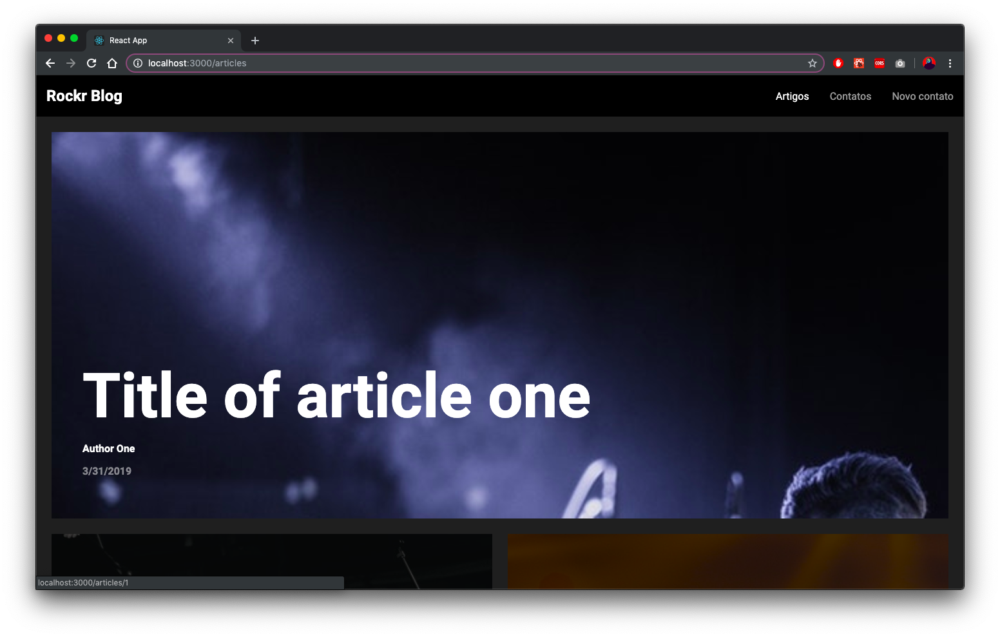
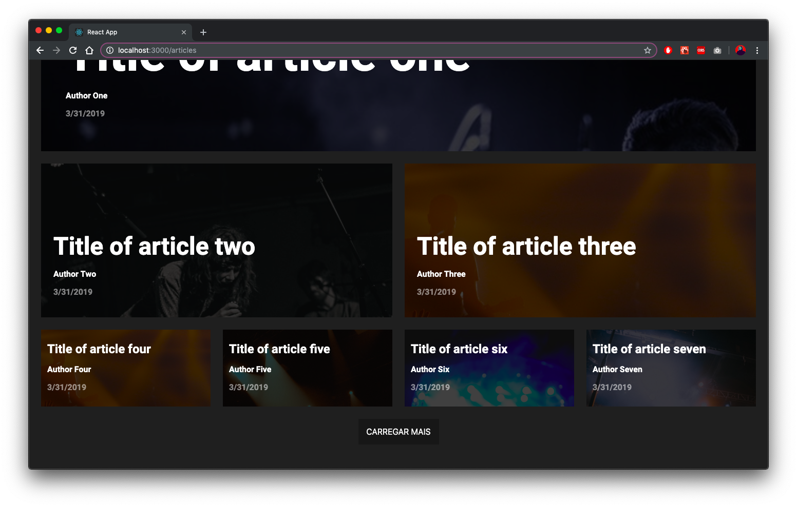
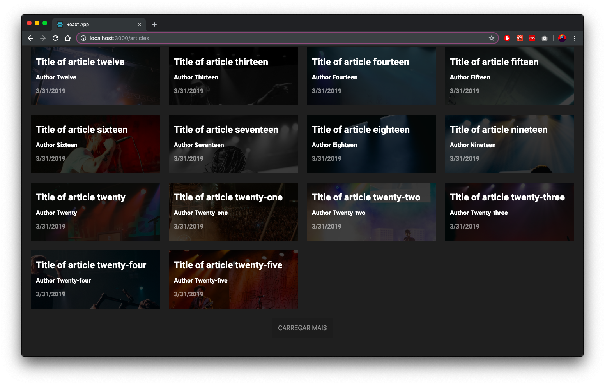
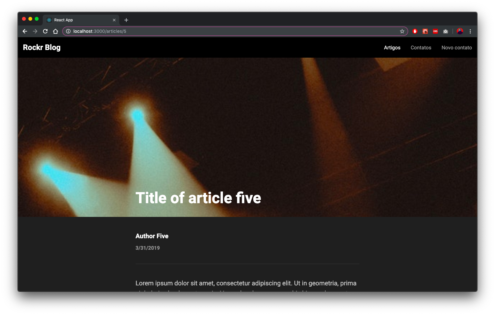
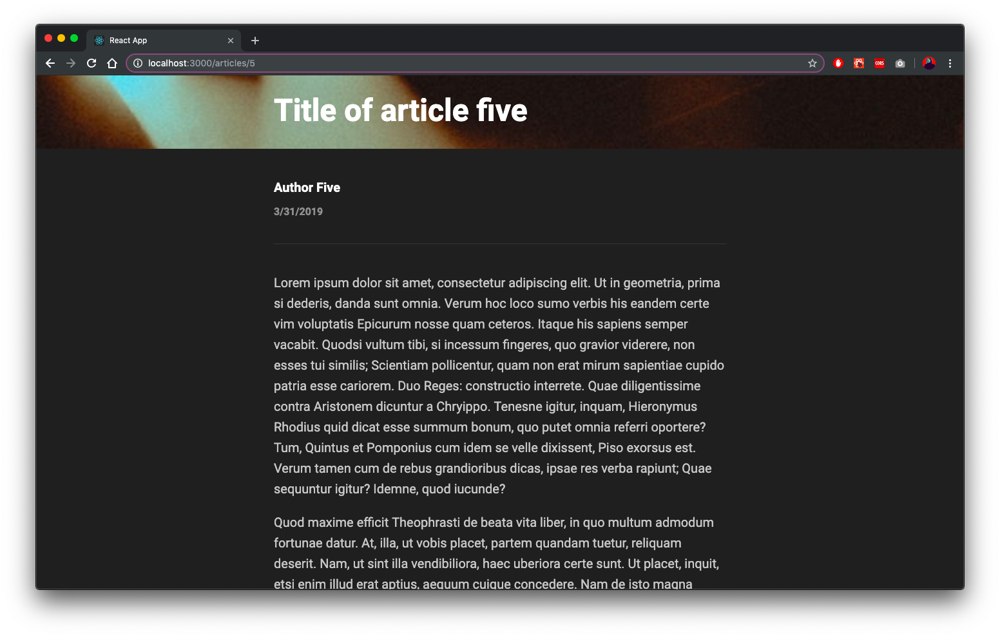
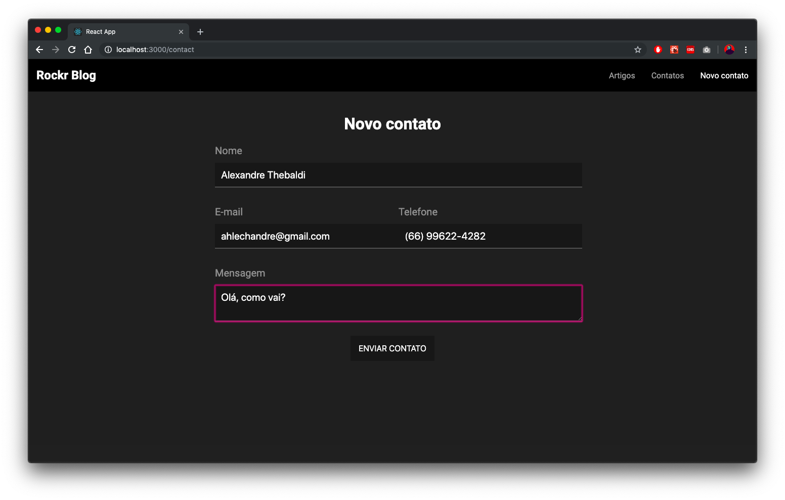
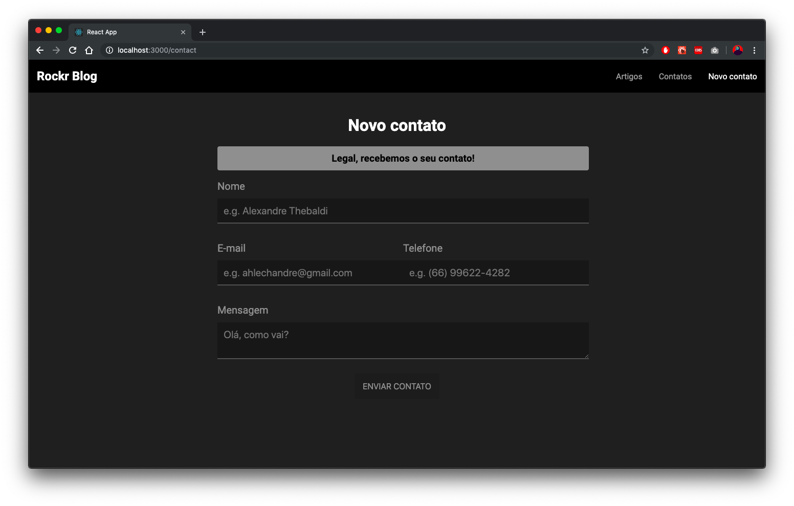
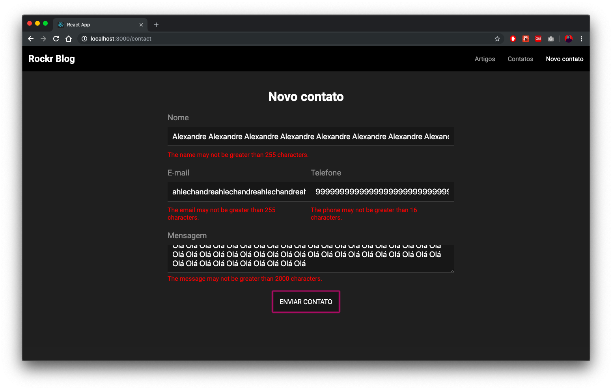
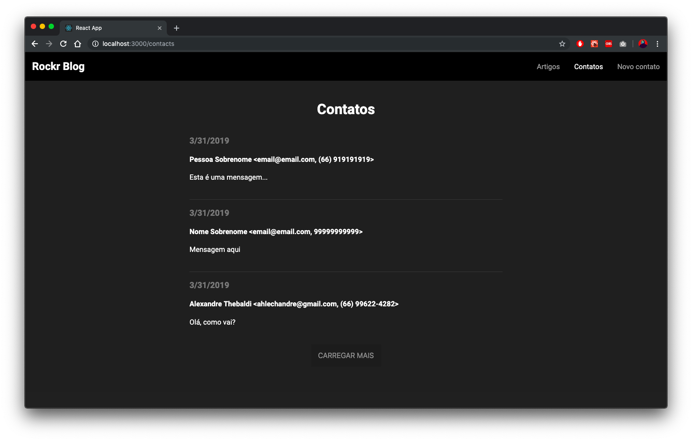

# Blog Rockr Web

Uma *Single Page Application* (SPA) para artigos e contatos feita (em algumas horas) com [React](https://reactjs.org/) e outras ferramentas modernas no desenvolvimento web. A aplicação consome dados da [Blog Rockr API](https://github.com/ahlechandre/rockr-blog-api).

## Instalação

1. Instale e execute a [Blog Rockr API](https://github.com/ahlechandre/rockr-blog-api).

2. Faça download do projeto:

```bash
git clone https://github.com/ahlechandre/rockr-blog-web.git
```

3. Acesse o diretório:

```bash
cd rockr-blog-web
```

4. Instale as dependências:

```bash
npm install
```

5. Configure os endpoints REST da sua [Blog Rockr API](https://github.com/ahlechandre/rockr-blog-api) no arquivo `./src/env.json`:

```json
{
  "debug": true,
  "api": {
    "articles": "http://localhost:8000/api/v1/articles/",
    "contacts": "http://localhost:8000/api/v1/contacts/"
  }
}
```

> ⚠️ **ATENÇÃO:** não remova a última `"/"` do endpoint.
> * ✅ Válido: http://localhost:8000/api/v1/contacts/
> * ☠️ Inválido: http://localhost:8000/api/v1/contacts

6. Inicie o projeto [CRA](https://github.com/facebook/create-react-app):

```bash
npm start
```

7. Abra uma guia do navegador em `http://localhost:3000`.

## Screenshots

1. **Artigos**: diferentes tamanhos (destaque) e paginação.







2. **Artigo**: imagem de capa, título e conteúdo.





3. **Novo contato**: feedbacks de validação e sucesso.







4. **Contatos**: lista de contatos ordenados por data.



## Third-party libraries

* `create-react-app`
  - **Motivação**: iniciar um projeto React com configuração mínima.
* `redux`
  - **Motivação**: manter o estado e a lógica da aplicação de forma centralizada, consistente e funcional.
  - **Como**: defininindo as ações e a lógica de como elas modificam o estado global (store) de acordo com cada interação com a [Blog Rockr API](https://github.com/ahlechandre/rockr-blog-api).
* `react-redux`
  - **Motivação**: prover o acesso ao estado global (store) para toda a árvore de componentes React.
  - **Como**: mapeando o estado global e o despache de ações para os componentes conectados à store.
* `redux-saga`
  - **Motivação**: trabalhar com efeitos colaterais (*side-effects*) de forma consistente e expressiva.
  - **Como**: assistindo as ações (do Redux) que demandam *side-effects* e aplicando os procedimentos necessários (e.g. buscar artigos, enviar contato).
* `redux-logger`
  - **Motivação**: visualizar todas as modificações de estado na sequência em que as ações são despachadas na store.
* `react-router-dom`
  - **Motivação**: definir roteamente na aplicação React.
* `styled-components`
  - **Motivação**: manter os estilos dos componentes de forma declarativa e encapsulada nos próprios módulos JavaScript ao invés de arquivos CSS externos.
* `@material/react-layout-grid`
  - **Motivação**: utilizar um sistema de Grid consistente e expressivo.
  - **Como**: importando os componentes oficiais (Grid, Row, Cell) e apenas parametrizando-os.